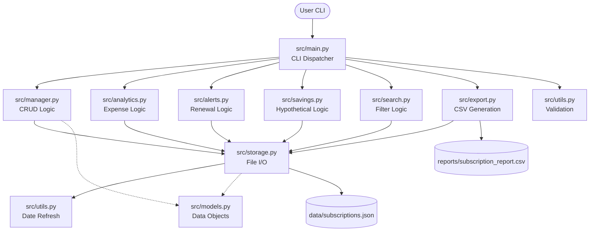

# SmartSub: Architecture

## Actual Project Architecture

The SmartSub CLI relies on a modular architecture composed of specialized Python files in a standard `src/` layout. It follows a procedural but highly separated design where the CLI entry point dispatches to I/O managers, which in turn coordinate pure calculation functions and disk access.

### Module Responsibilities and Relationships

- `src/main.py`: The entry point. Handles all `argparse` definitions, command-line routing, and user-facing error catching for validation failures.
- `src/manager.py`: Core CRUD operations (`add`, `list`, `update`, `delete`). It handles the business logic of modifying the subscription list and invoking the storage layer.
- `src/models.py`: Defines the `Subscription` class (used as a data container), JSON serialization/deserialization methods (`to_dict`, `from_dict`), and the allowed system categories.
- `src/storage.py`: Owns all JSON disk I/O. Defines the global `DATA_FILE` path, and handles `load_data` and `save_data`. It is also responsible for triggering the renewal-date refresh loop upon data load.
- `src/utils.py`: A dual-purpose module containing all input validation functions (`validate_cost`, `validate_date`, etc.) and the complex calendar arithmetic functions required to safely advance renewal dates across leap years and month boundaries.
- `src/analytics.py`: Contains the mathematical logic for summarizing expenses, converting billing cycles into the normalized `monthly_cost`, and grouping data by category.
- `src/alerts.py`: Handles the date-diff math required to identify subscriptions renewing within the next 7 days.
- `src/savings.py`: Splits logic into a pure mathematical function (`calculate_savings`) and an interactive CLI wrapper (`run_savings_analyzer`).
- `src/search.py`: Implements a pure filtering function (`filter_subscriptions`) utilizing Python list comprehensions, and a CLI wrapper to print the results.
- `src/export.py`: Handles CSV generation utilizing the standard library `csv` module, generating reports at a predefined disk location.
- `tests/test_tracker.py`: Contains 51 comprehensive unit tests relying on the `unittest` framework, using `tempfile` to isolate disk I/O tests.

## Mermaid Architecture Diagram

