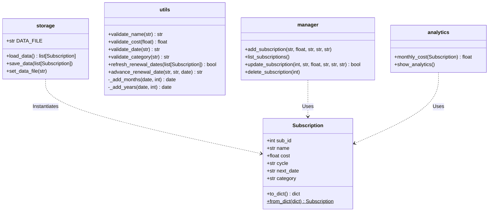
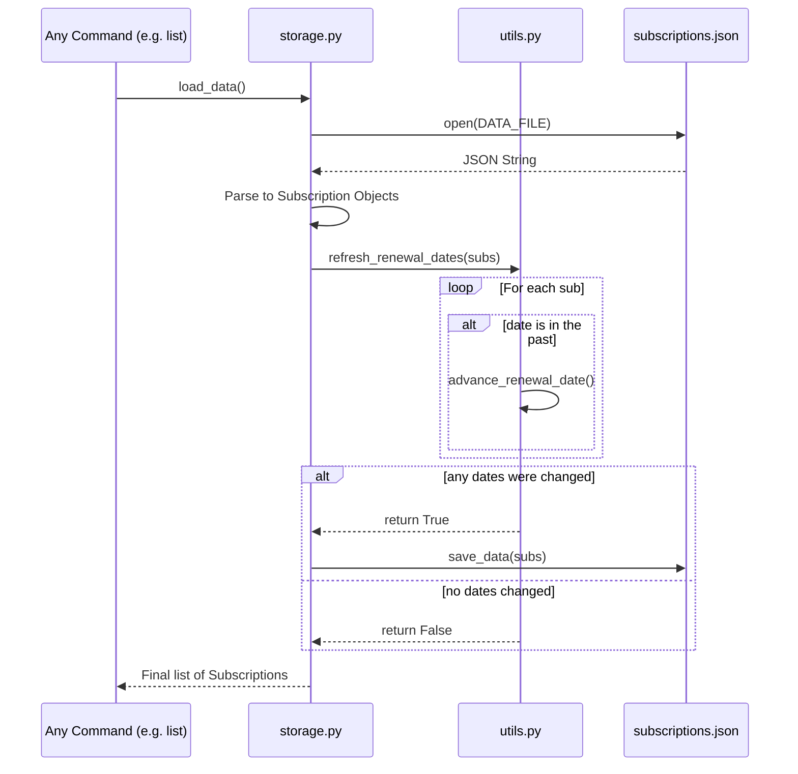

# SmartSub: UML Diagrams

## Use Case Diagram

```mermaid
usecaseDiagram
    actor User
    
    usecase "Add Subscription" as UC1
    usecase "List Subscriptions" as UC2
    usecase "Update Subscription" as UC3
    usecase "Delete Subscription" as UC4
    usecase "View Analytics" as UC5
    usecase "Check Alerts" as UC6
    usecase "Calculate Savings" as UC7
    usecase "Search Subscriptions" as UC8
    usecase "Export CSV" as UC9
    
    User --> UC1
    User --> UC2
    User --> UC3
    User --> UC4
    User --> UC5
    User --> UC6
    User --> UC7
    User --> UC8
    User --> UC9
```

## Class Diagram

*Note: SmartSub utilizes a procedural design relying on simple data classes rather than deep object-oriented inheritance.*



## Component Diagram

```mermaid
componentDiagram
    component "CLI Entry Point (main.py)" as CLI
    
    component "Business Logic" {
        component "Manager (CRUD)" as Mgr
        component "Analytics" as Ana
        component "Alerts" as Alrt
        component "Savings Analyzer" as Sav
        component "Search" as Srch
        component "CSV Export" as Exp
    }
    
    component "Core Services" {
        component "Validation & Date Math (utils.py)" as Util
        component "Data Models (models.py)" as Mod
    }
    
    component "Storage Layer (storage.py)" as Store
    
    database "subscriptions.json" as DB
    
    CLI --> Mgr
    CLI --> Ana
    CLI --> Alrt
    CLI --> Sav
    CLI --> Srch
    CLI --> Exp
    
    Mgr --> Store
    Ana --> Store
    Alrt --> Store
    Sav --> Store
    Srch --> Store
    Exp --> Store
    
    Store --> Util : auto-refreshes dates
    CLI --> Util : validates input
    
    Store --> DB
```

## Sequence Diagram: Data Load & Refresh Loop


