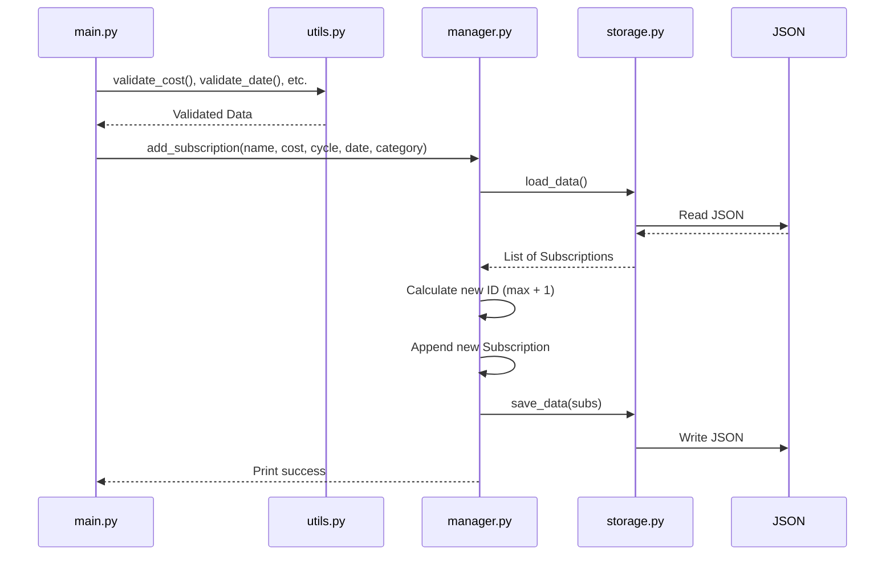
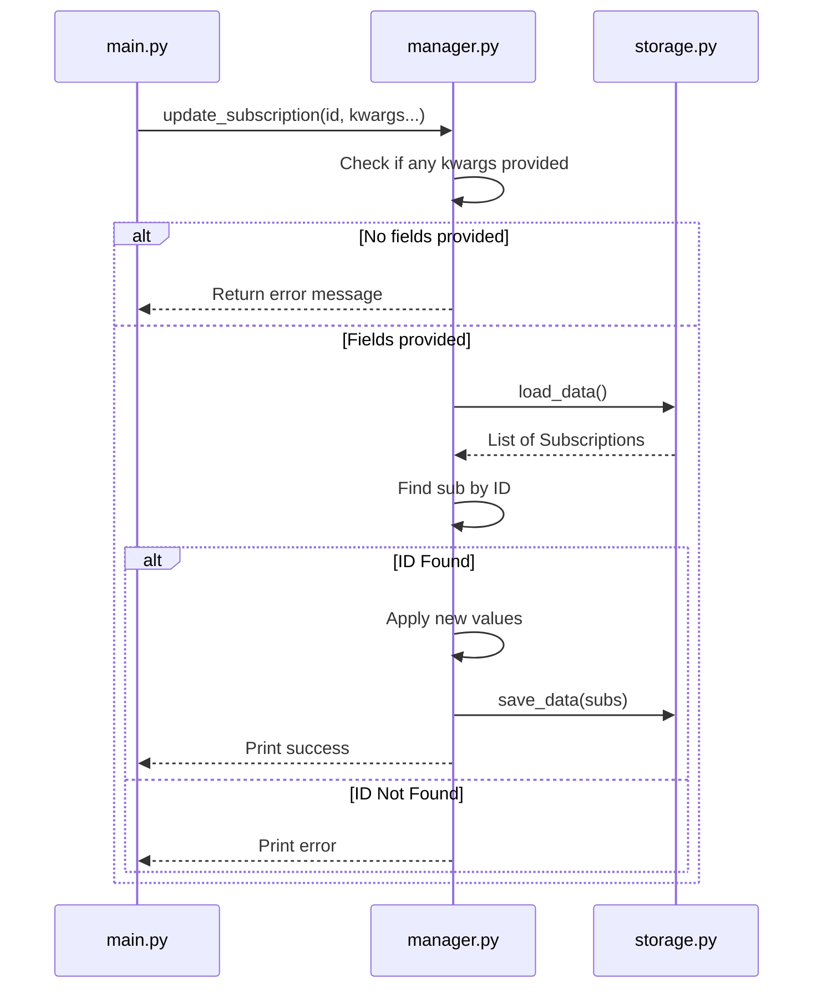
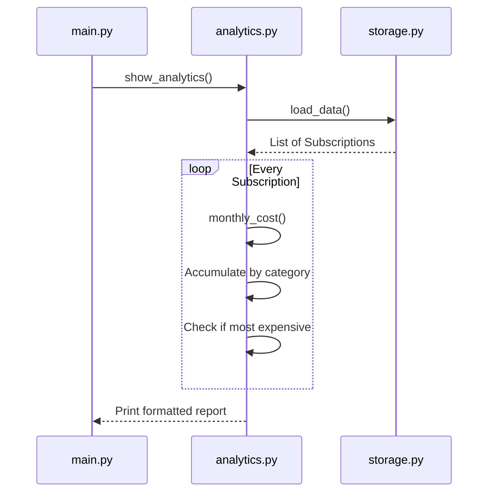
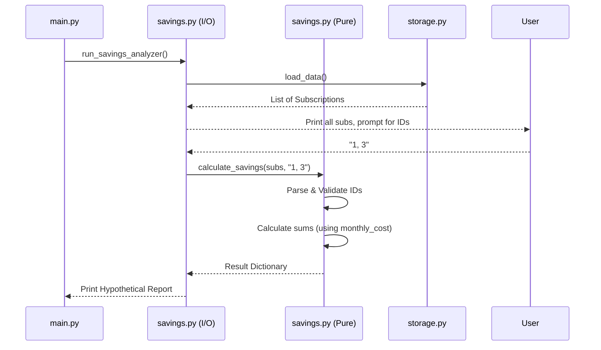

# SmartSub: Workflows

This document outlines the step-by-step workflow for every major CLI command.

## Mermaid Flowcharts

### 1. Add Workflow

### 2. Update Workflow

### 3. Analytics Workflow

### 4. Savings Workflow

## Detailed Text Workflows

### List Workflow
1. User calls `python3 -m src.main list`.
2. `main.py` calls `manager.list_subscriptions()`.
3. `manager.py` calls `storage.load_data()`.
4. `storage.py` parses the JSON file, refreshes any stale renewal dates, and returns the data.
5. `manager.py` loops through the list and prints a formatted ASCII table.

### Delete Workflow
1. User calls `python3 -m src.main delete <id>`.
2. `main.py` calls `manager.delete_subscription(id)`.
3. `manager.py` loads data, filters the list to remove the matching ID, and saves the new list to disk. Prints success or failure.

### Renewal/Alert Workflow
1. User calls `python3 -m src.main alerts`.
2. `main.py` calls `alerts.check_alerts()`.
3. `alerts.py` loads data (which inherently auto-advances any dates already in the past).
4. `alerts.py` compares the current date to every subscription's `next_date`.
5. If the difference is between 0 and 7 days, it is printed as an alert.

### Search Workflow
1. User calls `python3 -m src.main search <term> --category <cat>`.
2. `main.py` calls `search.run_search(term, category)`.
3. `search.py` loads data and passes it to the pure `filter_subscriptions()` function.
4. The pure function applies case-insensitive substring matching and returns a new list.
5. `search.py` prints the results as a table.

### Export Workflow
1. User calls `python3 -m src.main export`.
2. `main.py` calls `export.run_export()`.
3. `export.py` loads data, passes it to the pure `generate_report()` function.
4. The generator creates the `reports/` directory if needed, calculates equivalent costs, writes the CSV, and returns a summary object.
5. The wrapper prints the summary to the terminal.
